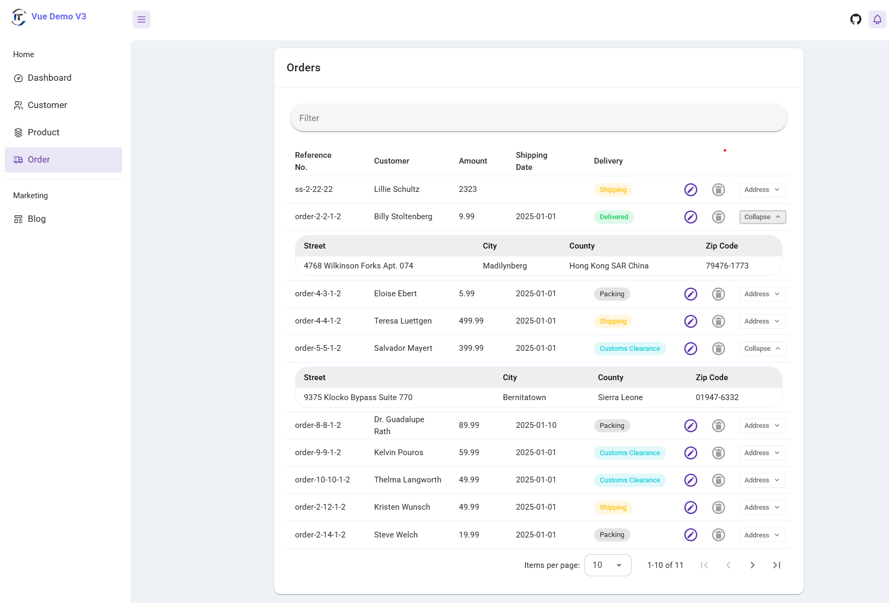
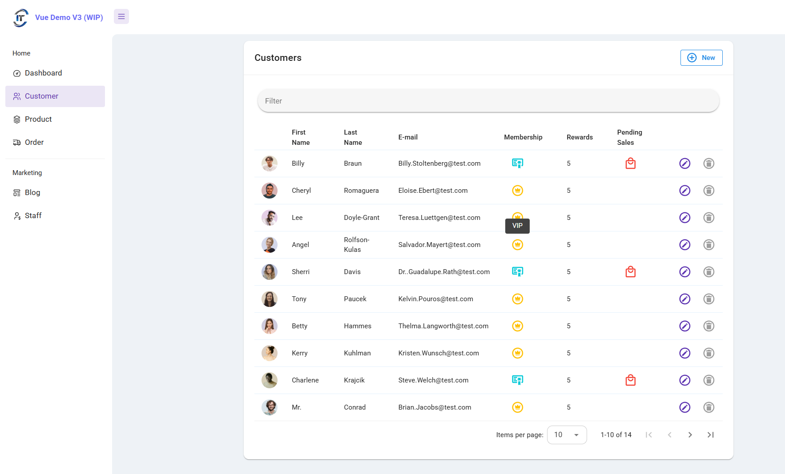
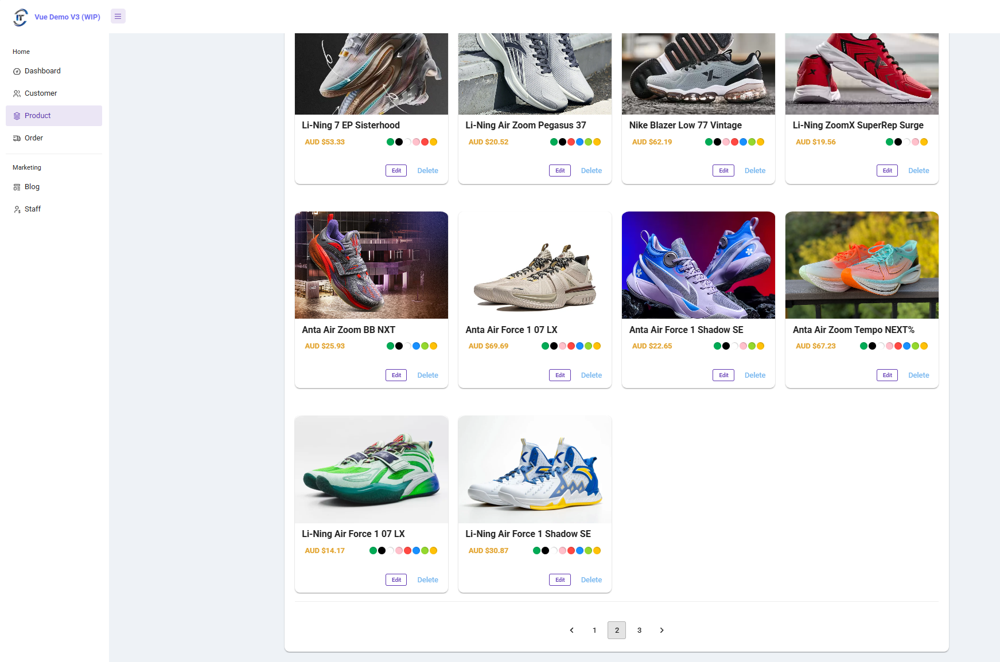
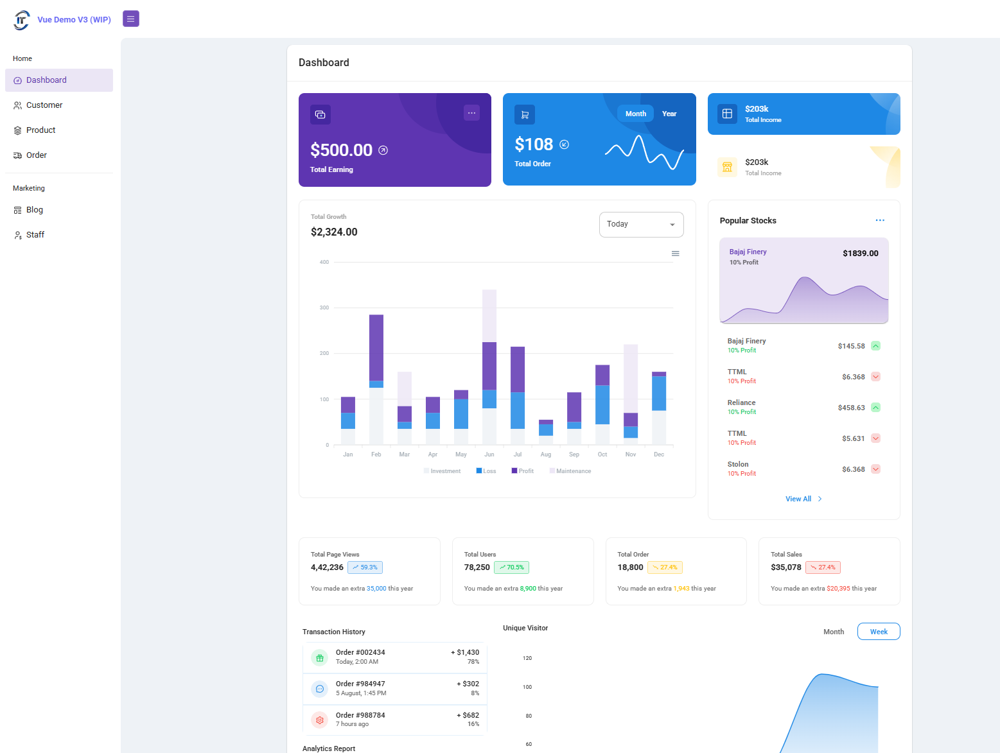
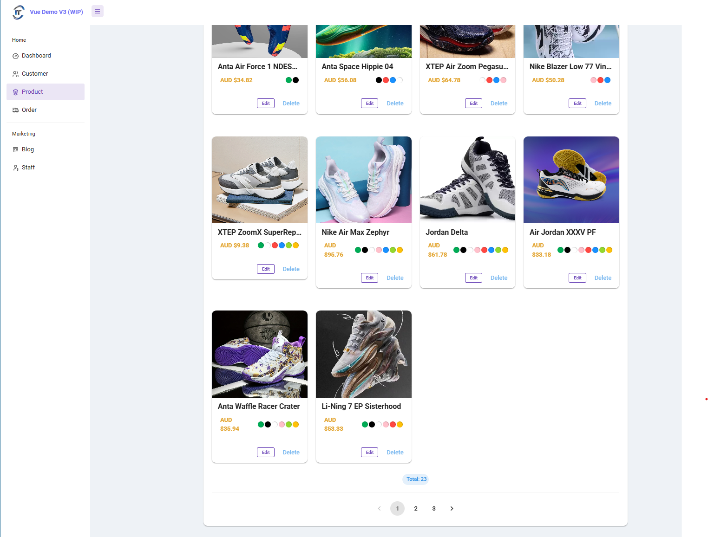
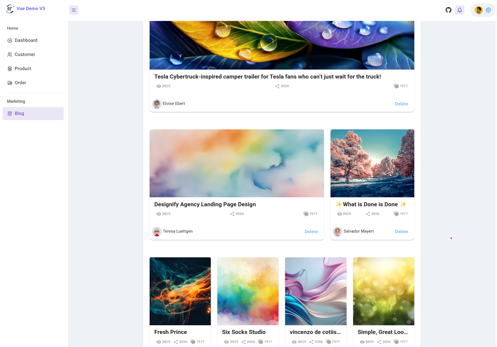

11# Vue Demo App V3

> A reusable Vue.js starter project for real-world business based on Vue 3 with Vuetify 3 and Pinia.

The goal of this project is to build a reusable starter project for real-world business. To achieve this target, we need a solution which includes state management (Pinia), fake restful API and elegant UI design (Vuetify).

### Live Demo

[Latest Demo App](https://vue-app-demo.harryho.org?timestamp=v3):  The demo is just a proof of concept. It doesn't have back-end API and all features of master branch.

[Previous version Demo App](https://vue-demo-v2.harryho.org?timestamp=v2):  The demo is just a proof of concept. It doesn't have back-end API and all features of master branch. Source code is availabe on a different [branch](https://github.com/harryho/vue-crm/tree/v2-vtf2)

### Screenshots

#### Latest Version

<!--  -->
<!--  -->

<!--  -->

#### Previous Version

